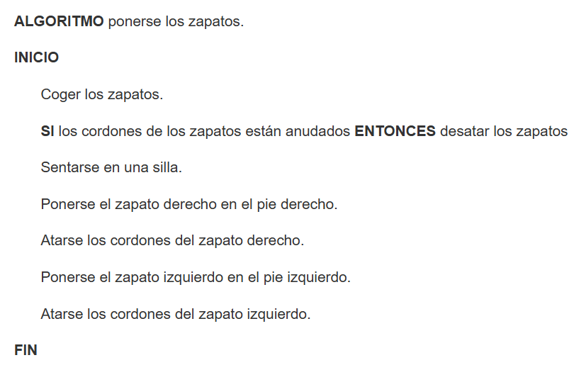
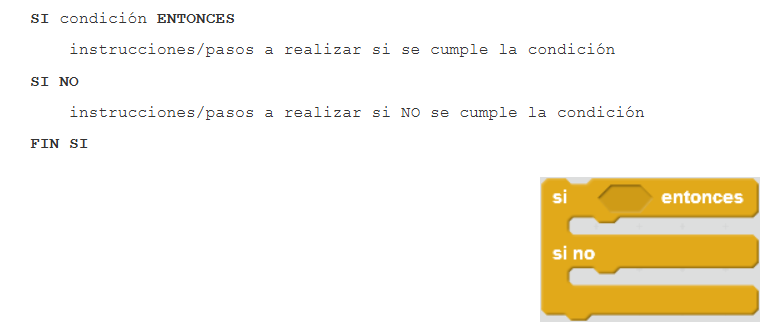
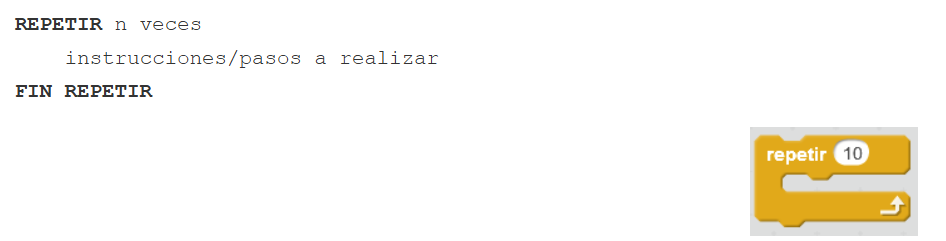
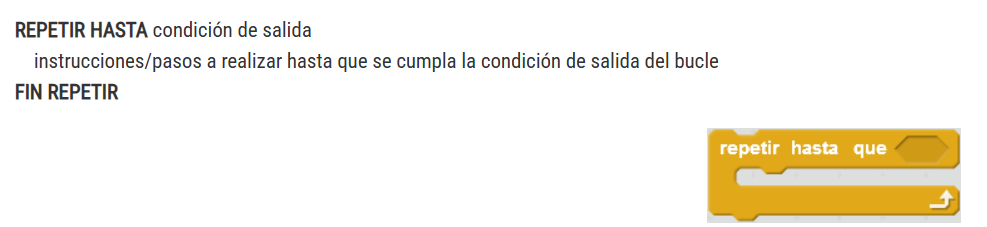
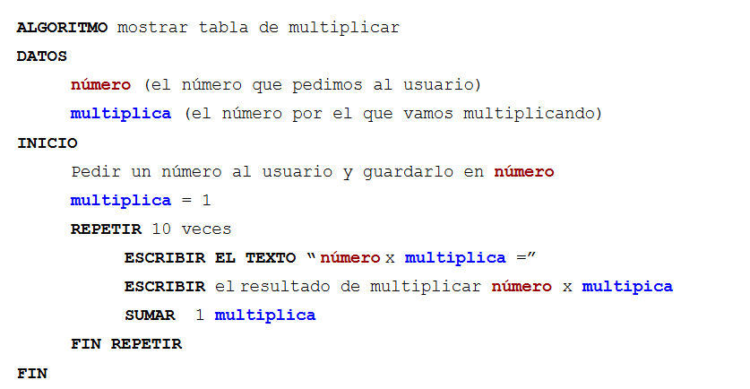
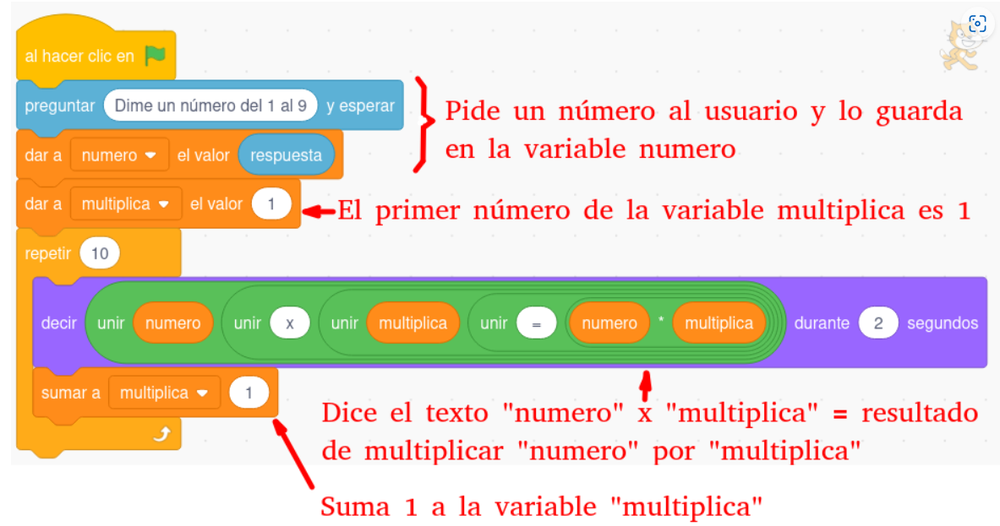

--- 
title: El pensamiento computacional
summary: Aplicación del pensamiento computacional en el aula.
authors:
    - Manuela Iborra
    - Jose Robledano
date: 2024-09-01
---
# **Acción con programación**

## **Algoritmos y pseudocódigo**

Un **algoritmo** es un conjunto ordenado de pasos a seguir (instrucciones concretas) que llevan a resolver un determinado problema.

Los algoritmos se pueden aplicar en cualquier área, no solo en la programación. Por ejemplo, una receta de cocina o una lista de pasos para armar un mueble son formas de algoritmos en la vida diaria.

Características de un algoritmo:

- Ser correcto (Resuelve el problema).

- Ser finito (Conduce a la solución en un tiempo dado).

- Ser flexible  (No es exclusivo para un tipo de problema sino que sirve como método general para distintos datos).

- Ser claro (comprensible por otras personas).

- Ser eficiente (ahorro de tiempo y recursos).

- Ser portable (independiente de la máquina o del lenguaje utilizado).  

El **pseudocódigo** es una forma de representar un algoritmo utilizando una mezcla de lenguaje natural (el idioma que usamos a diario, como español,inglés o valenciano) y elementos propios de la programación, pero sin seguir las reglas estrictas de un lenguaje de programación real. Sirve para describir los pasos del algoritmo de forma sencilla y entendible, sin preocuparse por la sintaxis específica de un lenguaje de programación.

No existe una sintaxis estándar para el pseudocódigo.

**Instrucciones condicionales**:

**Instrucciones repetitivas**:

## **Ejemplo de un algoritmo**

Queremos hacer un programa que pida un número al usuario y muestre la tabla de multiplicar de ese número.

Utilizando el lenguaje de programación de scratch sería:

