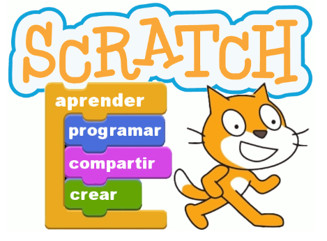
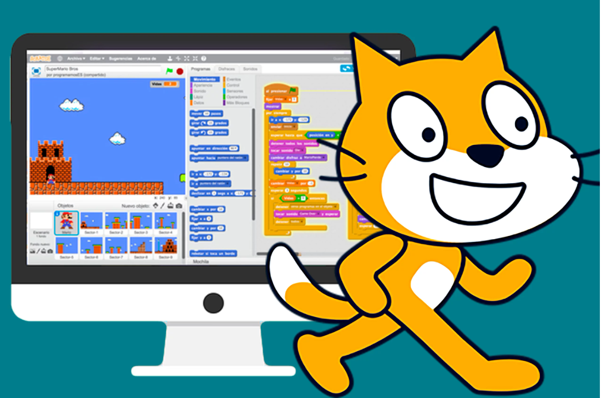

--- 
title: El pensamiento computacional
summary: Aplicación del pensamiento computacional en el aula.
authors:
    - Manuela Iborra
    - Jose Robledano
date: 2024-09-01
---
# **Herramientas para el Pensamiento Computacional**

## **La hora del código**

Es una iniciativa global que busca introducir a personas de todas las edades, especialmente estudiantes, en el mundo de la programación y el pensamiento computacional.

[enlace la hora del código](https://hourofcode.com/como){:target="_blank}

**Características de la Hora del Código:**

- Gratuita y accesible: Está diseñada para que cualquier persona, sin importar el acceso a recursos, pueda participar. Solo se necesita un ordenador o dispositivo móvil con conexión a internet.
  
- Actividades variadas: Los tutoriales y juegos son interactivos, y muchos incluyen personajes populares de videojuegos o películas, como Minecraft, Star Wars o Frozen, lo que hace que el aprendizaje sea divertido.
  
- Dirigido a todos: Está abierta a estudiantes de todas las edades, desde educación infantil hasta adultos, y no requiere experiencia previa en programación.

## **Blockly**

[enlace a Blockly](https://blockly.games/?lang=es){:target="_blank}

Es una aplicación similar a Scratch. **Blockly** es una herramienta de programación visual basada en bloques, que puede conectarse con lenguajes de programación reales como JavaScript, Python y Dart.

Proporciona una transición suave del pensamiento lógico al código escrito. Es personalizable para diferentes niveles de complejidad.

## **Scracht** 

Es una de las aplicaciones más extendidas en el mundo para trabajar el Pensamiento Computacional. Desarrollado por el Instituto de Tecnología de Massachusetts (MIT), su entorno permite introducirse en el mundo de la programación sin conocimientos complejos sobre código.

Scratch es un entorno de programación por bloques, con una interfaz sencilla, que permite crear historias digitales, juegos y animaciones y otros proyectos a personas de todas las edades, pero que fue pensado teniendo en cuenta principalmente a niños y niñas.

Scratch promueve el pensamiento computacional y las habilidades en resolución de problemas, la enseñanza y aprendizaje creativos, auto expresión y colaboración, igualdad... 

Se pueden incluir actividades basadas en Scratch en diferentes áreas, materias y grupos de edad. ¡La imaginación es el único límite!

Se programa mediante bloques y cuenta con una interfaz atractiva visualmente, permitiendo al alumnado comenzar a programar desde el primer momento. Se pueden crear historias interactivas, juegos, animaciones, música y producciones artísticas.

Scratch se trabaja como aplicación web, pero también está disponible en formato app  con el nombre de “Scratch Junior”. Dicha app permite a los alumnos y alumnas introducirse en la programación desde edades muy tempranas, pudiendo utilizarse desde los 5 años.

### **Principales características de Scratch**

1. **Programación basada en bloques**: Los usuarios ensamblan bloques de colores que representan diferentes acciones, lógicas o eventos. Estos bloques encajan como piezas de un rompecabezas, lo que facilita la comprensión de los conceptos de programación.

2. **Entorno visual**: Todo el proceso de creación es altamente visual, lo que permite a los estudiantes ver inmediatamente cómo sus instrucciones afectan a los personajes y objetos en la pantalla.

3. **Desarrollo de habilidades de pensamiento computacional**: Scratch ayuda a los usuarios a descomponer problemas complejos en pasos más pequeños, establecer patrones, trabajar con abstracciones y automatizar procesos mediante algoritmos, todas ellas habilidades clave en el pensamiento computacional.

4. **Comunicación y colaboración**: Scratch fomenta la participación de una comunidad global de usuarios que comparten sus proyectos, comentan y colaboran en ideas.

{width="300"}

### **Ejemplos de uso de Scratch en el pensamiento computacional:**

- **Animación de personajes**: Usar bucles y condicionales para mover personajes en la pantalla.
  
- **Juegos interactivos**: Crear interacciones con el teclado o el ratón que desencadenen eventos como cambios de escena, puntuaciones, o sonidos.
  
- **Historias interactivas**: Contar historias en las que los personajes respondan a eventos y se muevan a través de diferentes escenarios.

### **Scratch en diferentes materias**

Scratch es una herramienta que no solo se limita a la enseñanza de programación, sino que también puede ser utilizada para fortalecer habilidades creativas, colaborativas y de pensamiento crítico en una amplia variedad de disciplinas. Algunos argumentos sobre cómo Scratch puede beneficiar a diferentes áreas del conocimiento:

1. **Matemáticas**:
Scratch permite a los estudiantes visualizar conceptos matemáticos como coordenadas, geometría y secuencias numéricas de una manera interactiva y dinámica. Al crear simulaciones matemáticas, los alumnos desarrollan habilidades para descomponer problemas en pasos lógicos, algo fundamental en el aprendizaje matemático. Los bucles y variables en Scratch son útiles para enseñar patrones numéricos y secuencias.
2. **Ciencias**:
Los profesores pueden usar Scratch para que los alumnos creen modelos de fenómenos científicos, como el ciclo del agua, la interacción de ecosistemas, o simulaciones de movimientos físicos. Los alumnos pueden crear sus propios experimentos interactivos, lo que les permite visualizar de manera práctica conceptos como la gravedad o la energía cinética. Al trabajar en simulaciones, los alumnos deben razonar y tomar decisiones sobre cómo modelar un fenómeno científico, lo que fomenta el pensamiento crítico.
3. **Lengua y Literatura**:
Scratch permite a los alumnos crear historias interactivas, desarrollando habilidades narrativas y fomentando la creatividad. Los alumnos pueden crear personajes y desarrollar diálogos o situaciones que refuercen la comprensión de lecturas o temas literarios. Los alumnos pueden escribir guiones y ver cómo sus personajes interactúan con los escenarios que crean, promoviendo un enfoque divertido para desarrollar habilidades de escritura.
4. **Historia y Ciencias Sociales**:
Scratch puede ser usado para que los alumnos diseñen líneas de tiempo interactivas, permitiéndoles explorar eventos históricos de una manera dinámica y atractiva. Pueden recrear escenarios históricos, desarrollando una comprensión más profunda de los eventos al interactuar con ellos. Trabajar en grupos para investigar y crear proyectos en Scratch fomenta la colaboración y la investigación en temas sociales o históricos.
5. **Arte**:
Los alumnos pueden crear obras de arte animadas y experimentar con diferentes técnicas artísticas a través de Scratch. Además de la narrativa textual, pueden usar elementos visuales para expresar conceptos o historias, desarrollando tanto su creatividad como su pensamiento visual. Scratch combina sonido, imágenes y animación, lo que lo convierte en una excelente plataforma para proyectos artísticos multimedia.
6. **Música**:
Los alumnos pueden programar secuencias musicales, ajustando tiempos, repeticiones y notas, lo que les permite entender mejor la estructura musical.Pueden experimentar con diferentes ritmos y patrones musicales en tiempo real. Unir música con animaciones o historias en proyectos creativos que combinen varias áreas del conocimiento.
7. **Educación Física**:
Se pueden crear proyectos que simulen juegos y actividades físicas, ayudando a los estudiantes a comprender conceptos de salud y bienestar. Los alumnos pueden programar herramientas para rastrear sus propios logros físicos, como pasos o tiempos de carrera, mientras aprenden sobre hábitos saludables.

### **Ventajas para los profesores en todas las materias**

**Fomenta la creatividad**: Scratch permite a los alumnos desarrollar soluciones creativas a problemas complejos, lo que lo hace aplicable a cualquier área de estudio.

**Aprendizaje activo**: Los alumnos no solo aprenden teoría, sino que también aplican lo que aprenden a través de la creación de proyectos.

**Colaboración**: La plataforma de Scratch fomenta el trabajo en equipo, ya que los alumnos pueden compartir y colaborar en proyectos, uniendo diferentes disciplinas en un mismo proyecto.

**Adaptable a cualquier nivel**: Scratch es intuitivo y accesible, lo que lo convierte en una herramienta útil tanto para niveles básicos como avanzados.