--- 
title: El pensamiento computacional
summary: Aplicación del pensamiento computacional en el aula.
authors:
    - Manuela Iborra
    - Jose Robledano
date: 2024-09-01
---
# **Funcionamiento de Scratch**

[Enlace a Scratch](https://scratch.mit.edu/){:target="_blank}

## **Primeros pasos**

Los pasos ‌para empezar a usar Scratch son:

- Crear una⁤ cuenta en la página web de Scratch.
  
- Descargar ​el programa Scratch.
  
- Iniciar ‍sesión​ en Scratch y comenzar ​a ‌explorar el ​entorno de programación.

[Tutorial Scratch](https://scratch.org/es/learn-with-scratch/){:target="_blank}

## **Bloques**

Los bloques son los elementos mediante los que se programa en Scratch.Tienen forma de puzzle para encajar unos a continuación de otros, o unos dentro de otros.

Si un bloque no se puede poner en algún lugar en concreto del proyecto, no te dejará hacerlo.

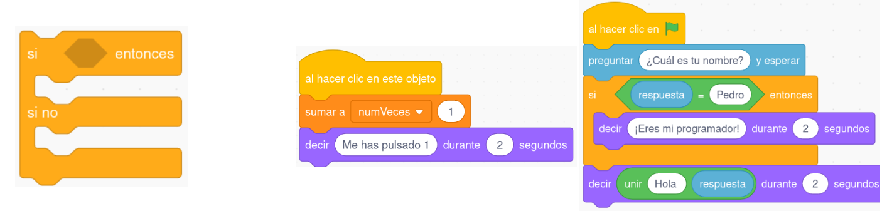

Se programa mediante bloques y cuenta con una interfaz atractiva visualmente, permitiendo al alumnado comenzar a programar desde el primer momento. Se pueden crear historias interactivas, juegos, animaciones, música y producciones artísticas.

Scratch se trabaja como aplicación web, pero también está disponible en formato app  con el nombre de “Scratch Junior”. Dicha app permite a los alumnos y alumnas introducirse en la programación desde edades muy tempranas, pudiendo utilizarse desde los 5 años.

## **Interfaz**

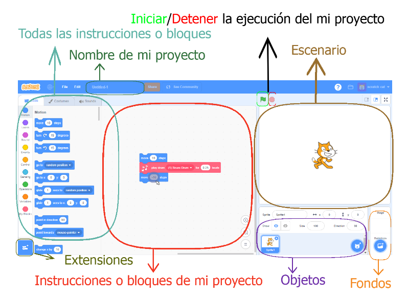

**Los objetos:**Son los elementos visuales que aparecerán en nuestro proyecto y sobre los que podremos actuar.

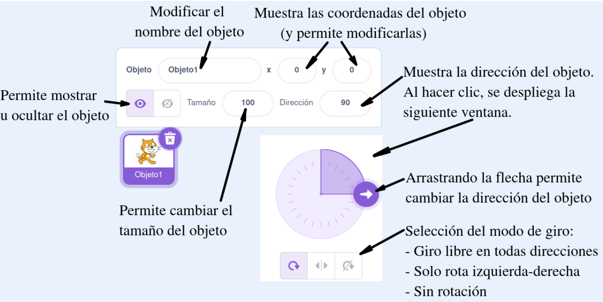

**El escenario:**Es la zona en la que los objetos trabajarán moviéndose, girando, etc.

- El centro del escenario es la coordenada (0,0).
  
- La coordenada x varía de -240 a 240.
  
- La coordenada y varía desde -180 a 180.
  
  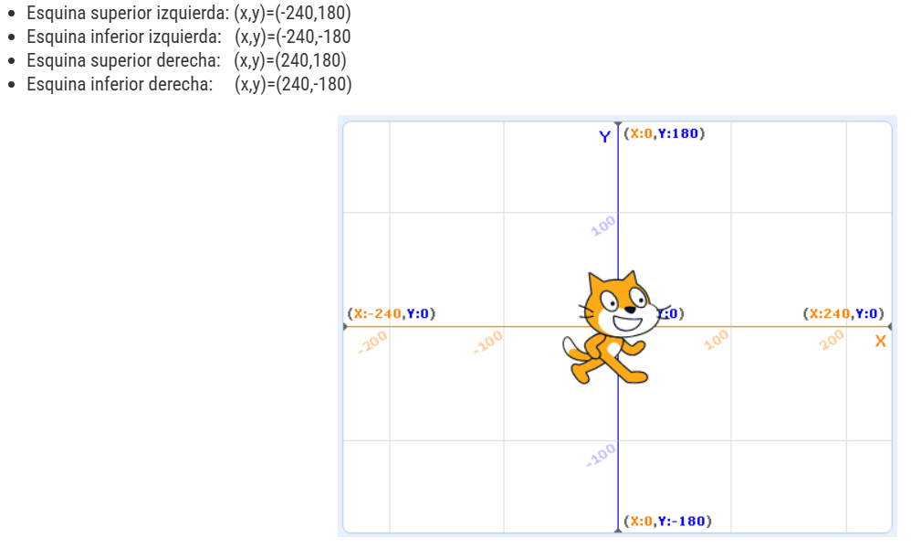

**El fondo:**Es la imagen o imágenes de fondo del escenario donde irán trabajando nuestros objetos.

**Todas las instrucciones:**Son todas las posibles instrucciones que podremos usar en nuestro proyecto. Las instrucciones también se denominan **bloques**.

**Las instrucciones de mi proyecto:**Son las instrucciones que habremos elegido para que se ejecuten dentro de nuestro proyecto. Las instrucciones de mi proyecto se consiguen arrastrando instrucciones de la zona “todas las instrucciones”.

**Extensiones:**Botón para añadir extensiones al proyecto.

## **Creación de un proyecto**

- **Code o código**: Se crea el programa para el objeto que tengamos arrastrando los bloques a la zona de "Instrucciones de mi proyecto".
  
  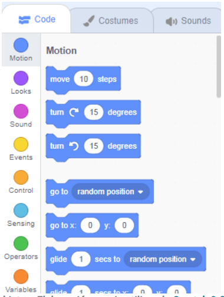

- **Costumes o Disfraces**: Se pueden modificar los disfraces o vistas del objeto.

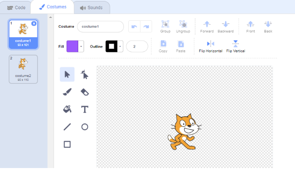
  
- **Sounds o Sonidos**: permite modificar los sonidos asociados al objeto.

## **Vídeos de ayuda**

[Primeros pasos](https://youtu.be/6r4xiq7jUik){:target="_blank}

[Crear objetos](https://youtu.be/UPW9J8qWi_A){:target="_blank}

## **Ejemplo sencillo paso a paso**

Cuando inicias Scratch, por defecto te aparece un único objeto que es el gato. Vamos a trabajas con él.

El objetivo es que el gato dibuje un cuadrado.

1. **Iniciar/detener el programa**: los dos botones que están sobre el escenario :

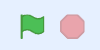

Por lo tanto iniciamos buscando en el código el siguiente bloque:

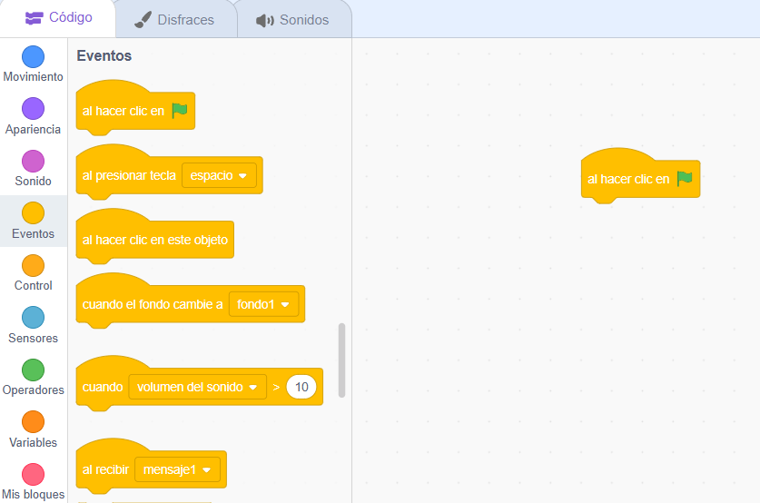

3. **Añadir extensión**: vamos a añadir el lápiz en la barra de código.

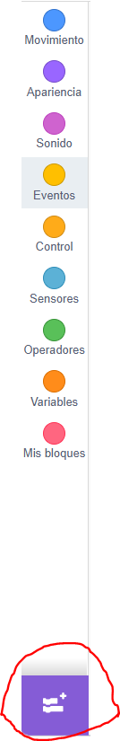{width="100"} 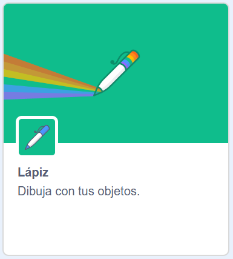{width="200"}

4. **Movimiento**:le damos movimiento al gato y giros para que dibuje el cuadrado.

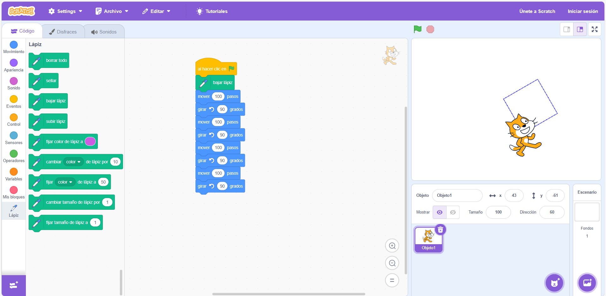

5. **Mejora del código**:

Se repiten los mismos bloques cuatro veces y esta no sería la forma óptima para hacerlo. Existe un bloque en **control** que es el de repetir donde le puedo indicar el número de veces que quiero repetir un bloque.

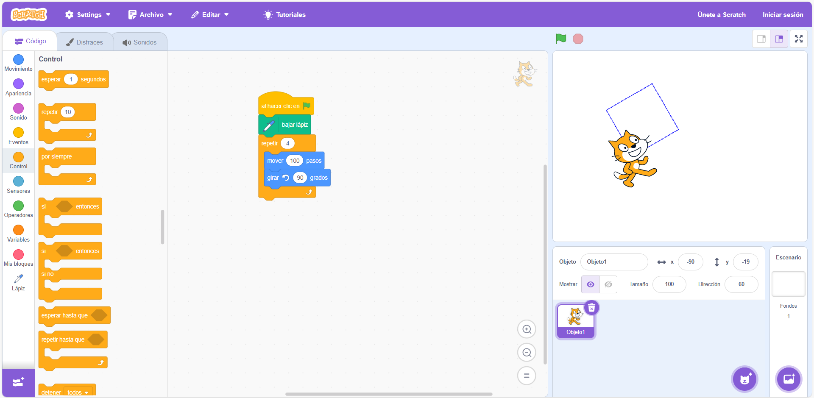

Otra forma de mejorar el código, es que antes de que empiece a dibujar, borre lo que hay dibujado anteriormente.

## **Disfraces y escenarios**

En la pestaña de disfraces, por defecto nos aparece el gato. Podemos añadir más disfraces desde el botón situado en la parte inferior.

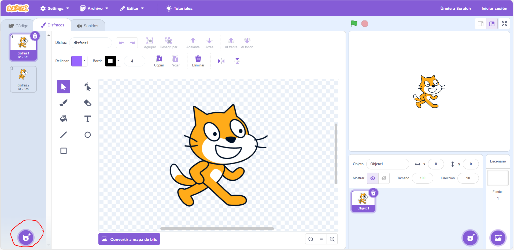

y elegir otro disfraz diferente:

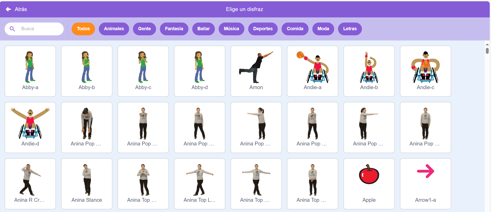

También puedo crear mi propio disfraz:

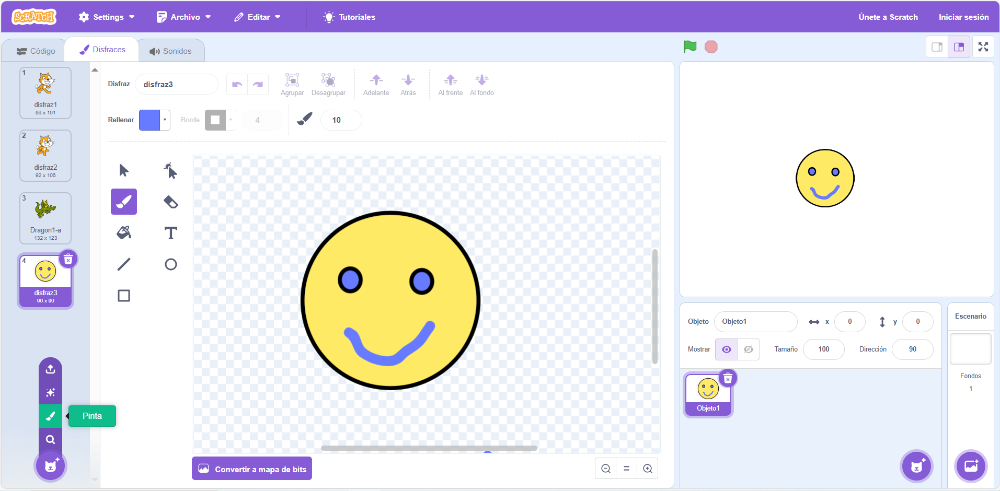

Un ejemplo sencillo:

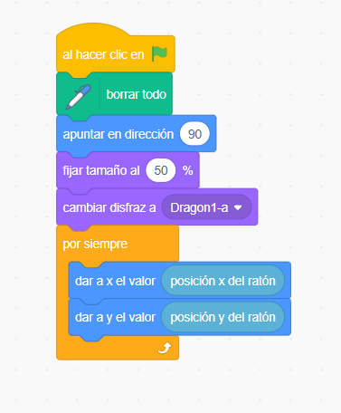

También se puede cambiar el escenario:

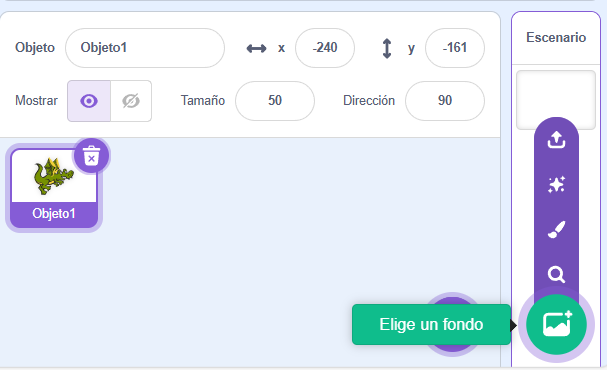

Elegimos dos fondos diferentes y vemos que en el panel de la izquierda ahora nos aparece una solapa con los fondos que tenemos seleccionados:

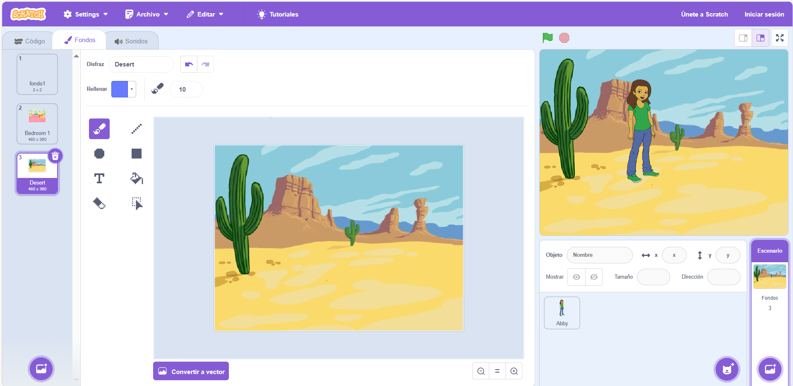

Ahora complementamos el programa siguiente:

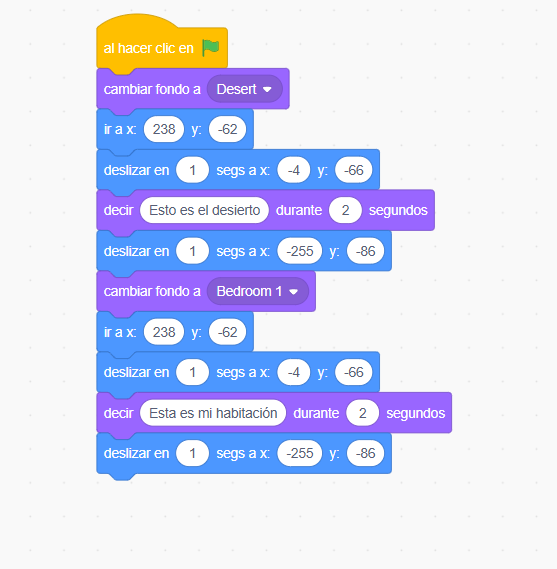

**Condiciones**

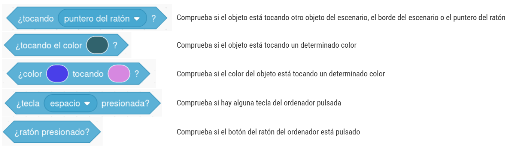

**Ejecución concurrente**

Se pueden realizar dos programas a la vez sobre el mismo objeto:

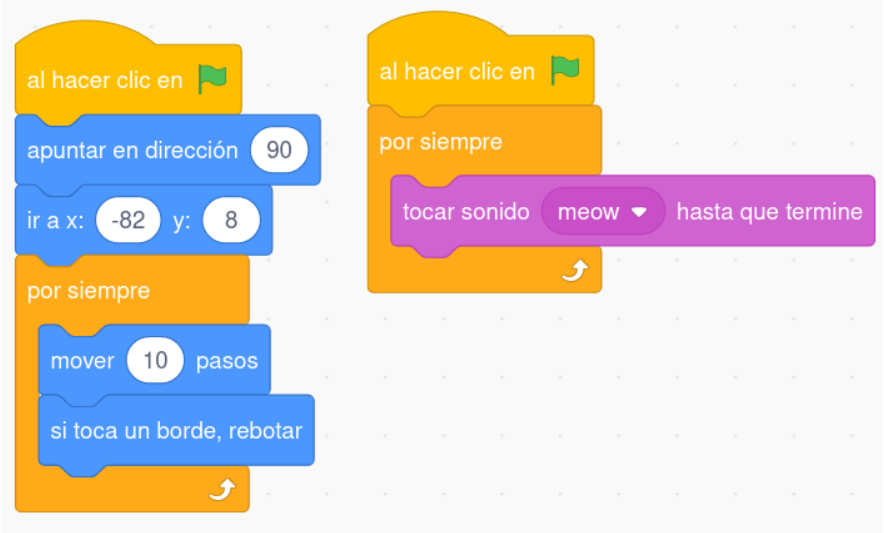

