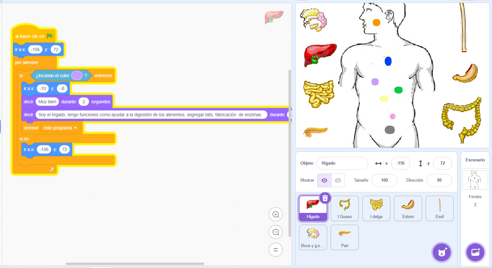
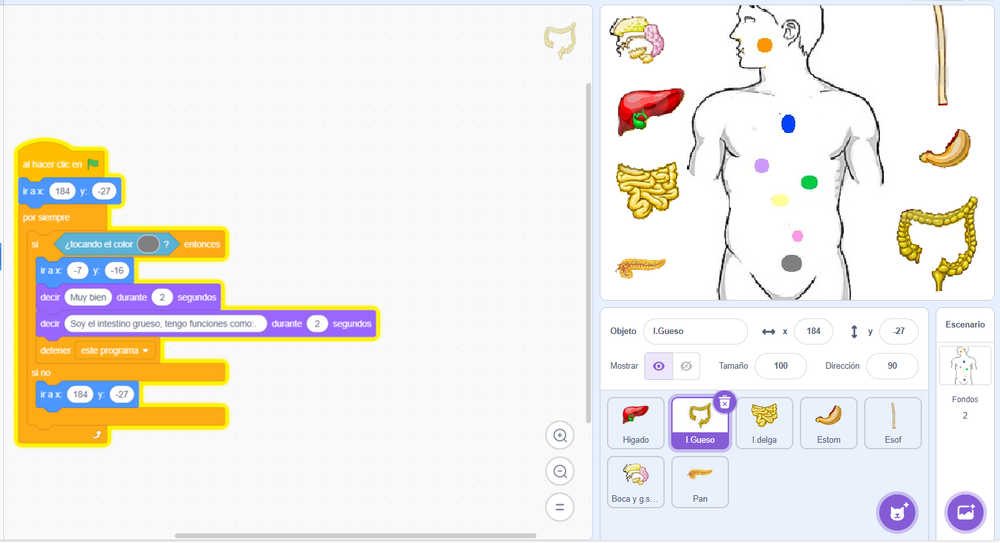
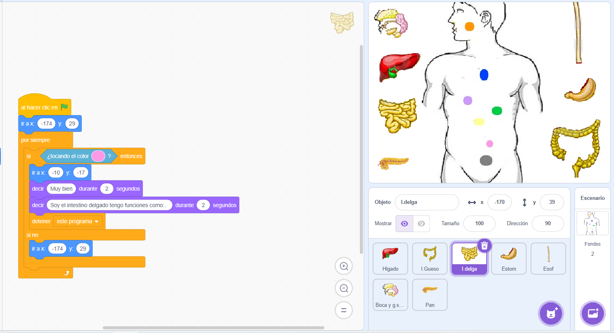
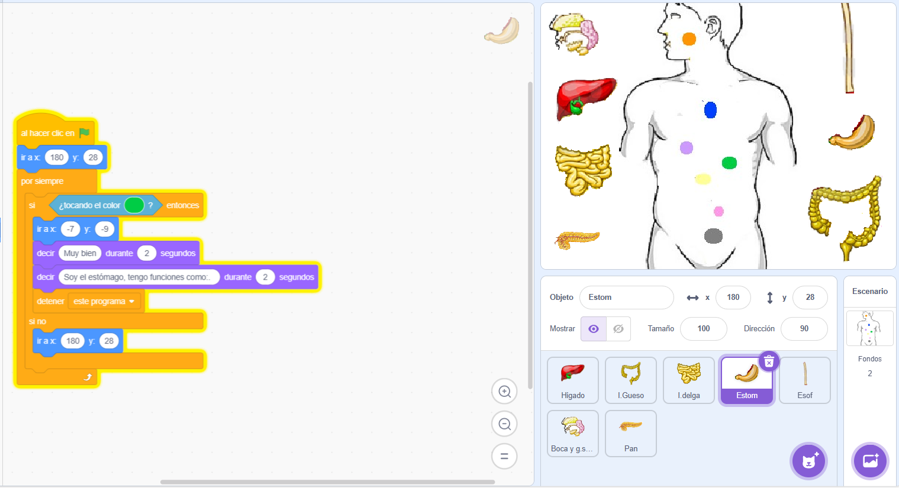
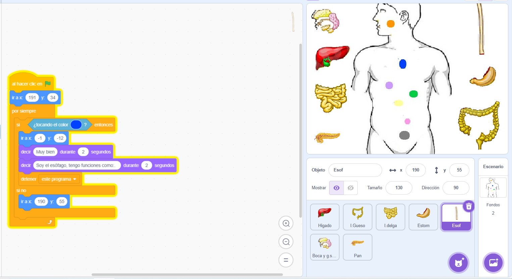
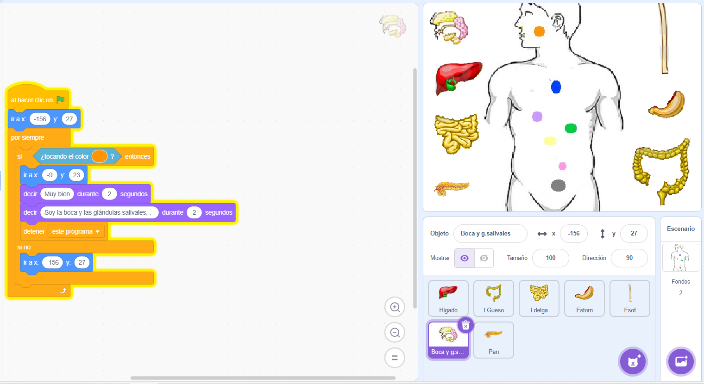
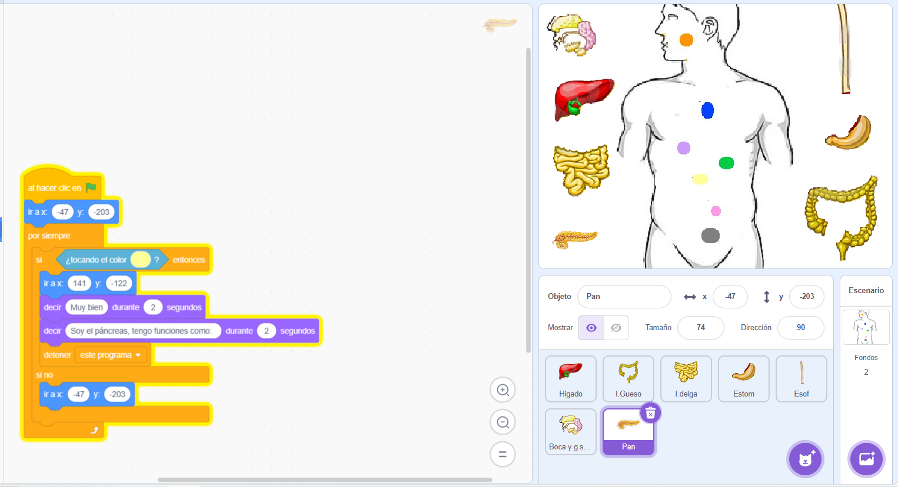
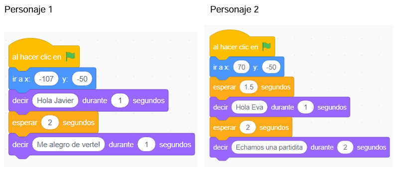

--- 
title: El pensamiento computacional
summary: Aplicación del pensamiento computacional en el aula.
authors:
    - Manuela Iborra
    - Jose Robledano
date: 2024-09-01
---
# **Proyectos con Scratch**

## **Los órganos del cuerpo**

 El proyecto muestra un esquema del cuerpo humano y junto a la imagen, encontramos siete órganos que deben ser arrastrado a la posición correcta; cuando el órgano queda ubicado en la posición correspondiente aparece un muy bien; además podrás obtener información importante sobre dicho órgano que te permitirá ampliar tus conocimientos. El alumno podrá aprender de una forma fácil dónde se encuentran localizados los órganos y qué función tienen.

 

## **Contar historias**

## **Simulación del corazón**

Si pulsas en el botón **circulación**, se representa la simulación de la circulación del corazón y si pulsamos el de **partes** y pinchamos en cada circulo, aparece el nombre de cada una de las partes.

[enlace a simulación](https://scratch.mit.edu/projects/3073414/editor/){:target="_blank}

